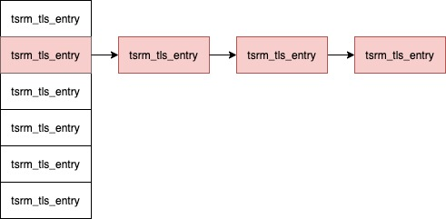
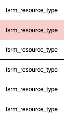

### 引

关于php tsrm机制的文章很多，但是都感觉没有讲到精髓，都是拿其相关的数据结构就一通讲，完全让人难以理解，最近工作涉及到了tsrm的东西，于是想自己总结一下tsrm，这短短不到800行的代码，是如何保证php的线程安全的，看着里面复杂的数据结构，可能让人难以入手。我想从线程安全的动机出发，维护一个线程安全需要什么？来帮助到有需要的人理解它，也给自己一个以后回过头来看的机会。 :)

### overview

在理解整个过程的之前，我们从设计tsrm的动机出发，而不是直接去看tsrm是什么。在单线程的模式下，一个全局变量，无论怎样的存储都不会出问题，在php的设计过程中有一些全局变量，充当着非常重要的角色，例如：

- compiler_globals
- executor_globals


那么在多线程下，去访问全局变量就会出现问题，就所谓的非线程安全，解决方式是需要把相关的全局变量给每个线程都复制一份。这里面就设计一个量级的关系：

- 线程的数量  t
- 相关全局变量的数量 g

所以我们可能需要复制t * g 个全局变量，再理一下关系，每个线程都着各自独立的“全局变量”。我们先不论这个“全局变量“放在哪里，我们可能是可以知道有g个”全局变量“，如果我们尝试把每个线程所有全局变量都紧密的放在一起。


[wrap="center"]

[/wrap] 


可以看到相同全局变量的相对于起始位置都有着相同的offset，只是起始位置不同，在切换进程的时候，我们只需要切换这个其实地址起就行，这样相同的全局变量，我们可以用一个新的全局变量来代替，这个新的全局变量就代表所指全局变量的offset，有了这个offset，我们就能拿到真实的“全局变量”，而且可以保证原代码的一致性，我们只需要调整以前全局变量的操作即可，这就是我理解的tsrm的设计细节。所以关键的是：

- 如何保证切线程的时候，存储线程全局变量的起始地址变化。
- 如何确定这个”全局变量“的offset

如果了解这两个东西，其他的细节并不是问题。

​	

### solutions

先来解决最前面的两个基础量级问题：

1. 线程数量的表示
2. 全局变量数量的表示

总体上解决方案是给每一个线程去”拷贝“一份全局变量，那么我们需要知道 线程数量 和 全局变量的数量。

#### 线程的保存

首先需要去抽象一个线程，然后把各个线程的信息保存下来。每个线程都会用一个tsrm_tls_entry结构来抽象，然后用一张表tsrm_tls_table串起来，

```c
struct _tsrm_tls_entry {
	void **storage;
	int count;
	THREAD_T thread_id;
	tsrm_tls_entry *next;
};

static tsrm_tls_entry	**tsrm_tls_table
```

（我这里不会一上来，跟说书一样就马上开始介绍每个字段的意义，因为没有动机，你会很难理解为什么这个字段存在）

这个tsrm_tls_table是一个二级指针，其实它终会指向一个tsrm_tls_entry的指针数组。直观上你可能会想，如果来一个tsrm_tls_entry，就把它的地址放在这个数组里面不就行了？其实不然。这个指针数组在tsrm设计里面，它其实是一张hashtable：

[wrap="center"]

[/wrap] 


你如果你熟悉HashTable，这看起来像不像用链表的形式来解决哈希冲突？那么hash值怎么计算呢？这里策略非常简单，直接用tsrm_tls_entry->thread_id % tsrm_tls_table_size，前面表示用线程号 模 tsrm_tls_table的长度去余。 所以这里tsrm_tls_table长度从一开始确定就不会变了，保持映射关系。默认情况，这个表的长度一般是1（我对这个长度持怀疑态度），如果长度为1，那么他就是一张单链表。

其中tsrm_tls_table是一个真正的全局变量，用来存储各个线程的信息

#### 全局变量的保存

为了避免线程操作全局变来带来的安全问题，我们把全局变量给每一个线程都“拷贝”了一份，那么试想，新创建了一个线程，我们需要把所有相关的全局变量都给它复制一份，那我们得先知道到底有多少个相关全局变量。所以在tsrm里面也用了一张类似tsrm_tls_table的东西来存储相关所有的全局变量。

为了存储全局变量，首先也得抽象全局变量。每一个全局变量用tsrm_resource_type来抽象表示，然后用一张resource_type_table表串起来。

```c
typedef struct {
	size_t size;
	ts_allocate_ctor ctor;
	ts_allocate_dtor dtor;
	size_t fast_offset;
	int done;
} tsrm_resource_type;

static tsrm_resource_type	*resource_types_table
```

resource_types_table指向是一个tsrm_resource_type数组。
[wrap="center"]

[/wrap] 

#### 线程相关全局变量

- 每一个线程独立相关的全局变量放在哪？

  与线程相关的结构只有tsrm_tls_entry,那么线程中的全局变量的存储肯定是围绕这个结构的，我先给答案，其实有两个地方可以存储：

  - tsrm_tls_entry结构的尾部
  - tsrm_tls_entry->storage


  tsrm_tls_entry的storage指向是一个指针数组，其中存储了每一个线程相关的全局变量真实的结构。这个很容易理解。


  在tsrm_tls_entry尾部存储，是一种性能优化的策略。不需要你再去fetch storage。可以通过线程相关的全局变量相对于tsrm_tls_entry的位置，快速的读写线程相关的全局变量。


  
[wrap="center"]

[/wrap] 


- 线程切换时如何保证线程相关全局变量一致？

  前面已经讨论过了，这里只需要保证每次操作相关全局变量的时候，是从线程对应的tsrm_tls_entry里面获取的就行。这里直接是使用了pthread_key_create ,pthread_key_set,pthread_getspecific来维护每个线程独立的tsrm_tls_entry的结构。关于它们的使用具体可以看看[多线程私有数据pthread_key_create](https://www.cnblogs.com/zhangxuan/p/6515264.html)，这里就不详细深入了。

- 线程相关全局变量的更新

  除了前面提到的，新创建一个线程的时候，需要把相关的全局变量给它拷贝一份，还有一种情况是，当一个线程新增一个全局变量的时候，其他的变量也需要新增这个全局变量，需要保持同步。

  当新增一个全局变量的时候，这个时候会先放到resource_type_table里面，再循环遍历所有的线程tsrm_tls_entry把新的全局变量添加进去，这个细节问题需要考虑一下。